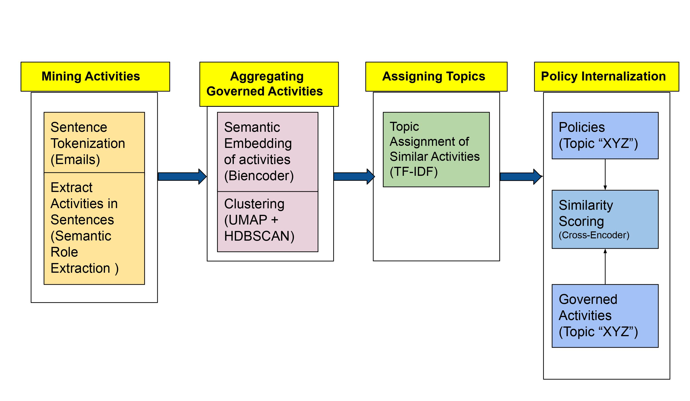

# ASFI_formalization

NLP pipeline for ["Do We Run How We Say We Run? Formalization and Practice of Governance in OSS Communities"](https://arxiv.org/pdf/2309.14245.pdf) accepted in Proceedings of the CHI Conference on Human Factors in Computing Systems [CHI '24], May 11-16, 2024, Honolulu, HI, USA.

## Data

Repo contains [policy data](./data/policies.csv) for testing basic text2rule (SRL) parsing code. Full data [Emails, Policies, Analysis] from the paper can be downloaded [here](https://storage.googleapis.com/public_data_c2/CHI_zenodo/CHI_zenodo.zip).   



## Organization

Scripts: 
```
- Preprocessing
	-- email_filtering: filtering emails for reporting reminders and JIRA/Github notifications
	-- srl_parsing: parsing activities/rules from email [column: 'reply'] and policies [column: 'policy.statement']
	-- dev_speak: remove logs/traces and other non-english dialogue

- Measurements
	-- internalization_scoring: calculate semantic similarity between rules and routine activities

- Analysis
	-- final_analysis: statistical inference on governance measurements
```

Notebooks: 
```
- Topic Modeling/Analysis
	-- cluster_tuning: Select best clustering model
	-- topic_prediction: Predict topics for all governed activities
```
## Reproduction 

Topic models, even classics like LDA, induce a small degree of stochasticity in labels/assignments. These resources help limit randomness in topic modeling: <br/> 
* [Reproducing deep models with Pytorch](https://pytorch.org/docs/stable/notes/randomness.html) <br/>
* [BERTopic](https://maartengr.github.io/BERTopic/faq.html#why-are-the-results-not-consistent-between-runs) and [UMAP](https://umap-learn.readthedocs.io/en/latest/reproducibility.html) 

Experiments were conducted on older versions of AllenNLP/AllenNLP-models no longer compatible with Colab. Repo has been updated to 2.10.1. Minor differences in parsing may be observed across versions.

AllenNLP is now in maintenance mode only. Check here for forks: <br/>
* [AllenNLP](https://github.com/Mahasweta-usc/allennlp) <br/>
* [ALlenNLP-models](https://github.com/Mahasweta-usc/allennlp-models)